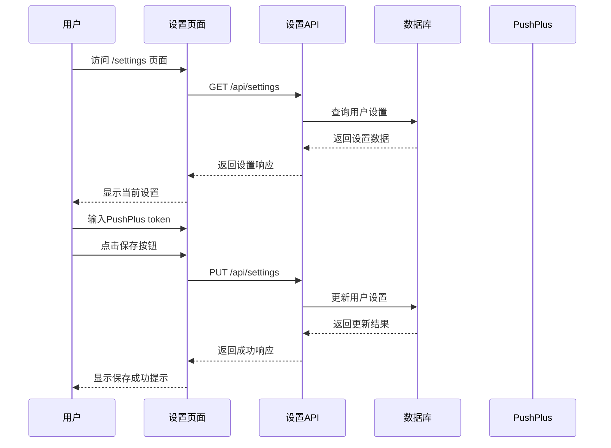
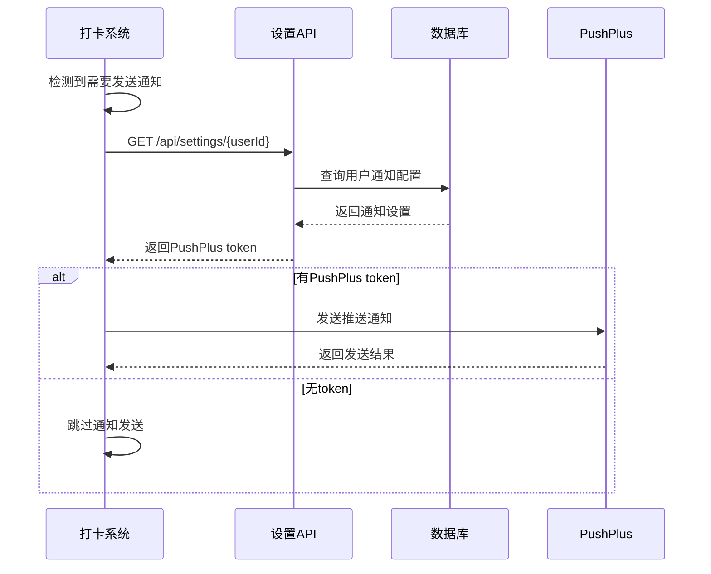

# 个人设置模块设计

## 功能概述
用户可以管理个人设置，主要包括消息通知配置。当前版本重点支持PushPlus通知服务，为用户提供及时的打卡提醒和奖励通知。

### 核心特性
- **PushPlus通知配置**：用户可以设置PushPlus token，接收打卡提醒
- **通知方式预留**：界面预留邮件、短信等通知方式，当前版本暂不支持（显示为灰色）
- **设置管理**：用户可以查看和修改自己的个人设置

### 关键概念
- **PushPlus Token**：用户在PushPlus官网申请的唯一标识符，用于接收推送通知
- **通知配置**：用户设置的各种通知方式和偏好设置
- **设置持久化**：用户设置保存到数据库中，确保设置的持久性

## 用户角色和权限
### 角色定义
- **普通用户**：可以查看和修改自己的个人设置

### 权限矩阵
| 操作 | 普通用户 |
|------|----------|
| 查看个人设置 | ✅ 
| 修改个人设置 | ✅ 

## 业务规则
### 基本规则
- 用户只能查看和修改自己的设置
- PushPlus token为字符串，由数字和字母组成
- 删除token需要确保所有打卡配置中的通知方式都已关闭

### 业务约束
- **唯一性**：一个用户只能有一套设置配置
- **可用性**：设置页面必须响应式，支持移动端访问

## 业务流程
### 用户设置PushPlus通知



### 系统发送通知查询配置



## 数据库设计

### 用户设置表
```sql
-- 用户设置表
CREATE TABLE user_settings (
    id UUID PRIMARY KEY DEFAULT gen_random_uuid(),
    user_id UUID NOT NULL UNIQUE,
    
    -- 通知配置
    pushplus_token VARCHAR(32), -- PushPlus token
    email_enabled BOOLEAN DEFAULT FALSE, -- 邮件通知开关（预留）
    sms_enabled BOOLEAN DEFAULT FALSE, -- 短信通知开关（预留）
    
    -- 通知偏好（预留）
    notification_time VARCHAR(5) DEFAULT '09:00', -- 通知时间 HH:MM
    timezone VARCHAR(50) DEFAULT 'Asia/Shanghai', -- 时区
    
    -- 系统字段
    created_at TIMESTAMP WITH TIME ZONE DEFAULT NOW(),
    updated_at TIMESTAMP WITH TIME ZONE DEFAULT NOW(),
    version INTEGER DEFAULT 1 -- 乐观锁版本号
);

-- 创建索引
CREATE INDEX idx_user_settings_user_id ON user_settings(user_id);
```

### 数据约束
```sql
-- 业务约束
ALTER TABLE user_settings ADD CONSTRAINT chk_pushplus_token_format 
    CHECK (pushplus_token IS NULL OR LENGTH(pushplus_token) = 32);

ALTER TABLE user_settings ADD CONSTRAINT chk_notification_time_format 
    CHECK (notification_time ~ '^([0-1]?[0-9]|2[0-3]):[0-5][0-9]$');
```

## HTTP Restful API接口设计

### 模块编号
模块号：`SETTINGS` (个人设置模块)

### 认证方式
- **用户认证**：Bearer Token (JWT)
- **系统调用**：内部服务调用，用于查询通知配置

### 业务错误代码
| 错误码 | HTTP状态码 | 描述 |
|--------|------------|------|
| SETTINGS_NOT_FOUND | 404 | 用户设置不存在 |
| INVALID_TOKEN_FORMAT | 400 | PushPlus token格式错误 |
| SETTINGS_UPDATE_FAILED | 500 | 设置更新失败 |

### API接口定义

#### 获取用户设置
```http
GET /api/settings
Authorization: Bearer {token}

Response 200:
{
  "id": "uuid",
  "userId": "uuid",
  "pushplusToken": "abc123...", // 前端显示时需脱敏
  "emailEnabled": false,
  "smsEnabled": false,
  "notificationTime": "09:00",
  "timezone": "Asia/Shanghai",
  "createdAt": "2024-01-01T00:00:00Z",
  "updatedAt": "2024-01-01T00:00:00Z"
}

Response 404:
{
  "error": "SETTINGS_NOT_FOUND",
  "message": "用户设置不存在，将创建默认设置"
}
```

#### 更新用户设置
```http
PUT /api/settings
Authorization: Bearer {token}
Content-Type: application/json

Request Body:
{
  "pushplusToken": "abc123def456...", // 32位token
  "notificationTime": "09:00"
}

Response 200:
{
  "id": "uuid",
  "userId": "uuid",
  "pushplusToken": "abc123...", // 脱敏显示
  "emailEnabled": false,
  "smsEnabled": false,
  "notificationTime": "09:00",
  "timezone": "Asia/Shanghai",
  "updatedAt": "2024-01-01T00:00:00Z"
}

Response 400:
{
  "error": "INVALID_TOKEN_FORMAT",
  "message": "PushPlus token格式错误，应为32位字符串"
}
```

#### 系统查询用户通知配置
```http
GET /api/settings/{userId}/notification
Authorization: Internal-Service

Response 200:
{
  "pushplusToken": "abc123def456...", // 完整token
  "emailEnabled": false,
  "smsEnabled": false,
  "notificationTime": "09:00",
  "timezone": "Asia/Shanghai"
}
```

## TypeScript 类型定义

### 数据库模型类型
```typescript
// 数据库原始类型
interface UserSettingsDB {
  id: string;
  user_id: string;
  pushplus_token: string | null;
  email_enabled: boolean;
  sms_enabled: boolean;
  notification_time: string;
  timezone: string;
  created_at: string;
  updated_at: string;
  version: number;
}
```

### 业务模型类型
```typescript
// 业务模型类型
interface UserSettings {
  id: string;
  userId: string;
  pushplusToken: string | null;
  emailEnabled: boolean;
  smsEnabled: boolean;
  notificationTime: string;
  timezone: string;
  createdAt: Date;
  updatedAt: Date;
  version: number;
}

// 通知配置类型
interface NotificationConfig {
  pushplusToken: string | null;
  emailEnabled: boolean;
  smsEnabled: boolean;
  notificationTime: string;
  timezone: string;
}

// 通知方式枚举
enum NotificationMethod {
  PUSHPLUS = 'pushplus',
  EMAIL = 'email',
  SMS = 'sms'
}
```

### 类型转换函数
```typescript
// 数据库类型转业务类型
function dbToUserSettings(dbSettings: UserSettingsDB): UserSettings {
  return {
    id: dbSettings.id,
    userId: dbSettings.user_id,
    pushplusToken: dbSettings.pushplus_token,
    emailEnabled: dbSettings.email_enabled,
    smsEnabled: dbSettings.sms_enabled,
    notificationTime: dbSettings.notification_time,
    timezone: dbSettings.timezone,
    createdAt: new Date(dbSettings.created_at),
    updatedAt: new Date(dbSettings.updated_at),
    version: dbSettings.version
  };
}

// 业务类型转数据库类型
function userSettingsToDb(settings: Partial<UserSettings>): Partial<UserSettingsDB> {
  return {
    ...(settings.id && { id: settings.id }),
    ...(settings.userId && { user_id: settings.userId }),
    ...(settings.pushplusToken !== undefined && { pushplus_token: settings.pushplusToken }),
    ...(settings.emailEnabled !== undefined && { email_enabled: settings.emailEnabled }),
    ...(settings.smsEnabled !== undefined && { sms_enabled: settings.smsEnabled }),
    ...(settings.notificationTime && { notification_time: settings.notificationTime }),
    ...(settings.timezone && { timezone: settings.timezone }),
    ...(settings.version !== undefined && { version: settings.version })
  };
}
```

### 请求/响应类型
```typescript
// 更新设置请求
interface UpdateSettingsRequest {
  pushplusToken?: string | null;
  notificationTime?: string;
  timezone?: string;
}

// 设置响应（脱敏）
interface SettingsResponse {
  id: string;
  userId: string;
  pushplusToken: string | null; // 前端显示时脱敏
  emailEnabled: boolean;
  smsEnabled: boolean;
  notificationTime: string;
  timezone: string;
  createdAt: string;
  updatedAt: string;
}

// 通知配置响应（系统内部用）
interface NotificationConfigResponse {
  pushplusToken: string | null; // 完整token
  emailEnabled: boolean;
  smsEnabled: boolean;
  notificationTime: string;
  timezone: string;
}
```

### 核心服务类设计
```typescript
// 设置服务类
class SettingsService {
  constructor(
    private supabaseClient: SupabaseClient,
    private logger: Logger
  ) {}

  /**
   * 获取用户设置
   * @param userId 用户ID
   * @returns 用户设置信息
   */
  async getUserSettings(userId: string): Promise<UserSettings | null> {
    const { data, error } = await this.supabaseClient
      .from('user_settings')
      .select('*')
      .eq('user_id', userId)
      .single();

    if (error) {
      if (error.code === 'PGRST116') {
        // 记录不存在，创建默认设置
        return this.createDefaultSettings(userId);
      }
      throw error;
    }

    return dbToUserSettings(data);
  }

  /**
   * 更新用户设置
   * @param userId 用户ID
   * @param request 更新请求
   * @returns 更新后的设置
   */
  async updateUserSettings(
    userId: string,
    request: UpdateSettingsRequest
  ): Promise<UserSettings> {
    // 验证请求
    this.validateUpdateRequest(request);

    const updates = userSettingsToDb({
      ...request,
      updatedAt: new Date()
    });

    const { data, error } = await this.supabaseClient
      .from('user_settings')
      .update(updates)
      .eq('user_id', userId)
      .select()
      .single();

    if (error) throw error;

    return dbToUserSettings(data);
  }

  /**
   * 获取用户通知配置（系统内部调用）
   * @param userId 用户ID
   * @returns 通知配置
   */
  async getNotificationConfig(userId: string): Promise<NotificationConfig | null> {
    const settings = await this.getUserSettings(userId);
    if (!settings) return null;

    return {
      pushplusToken: settings.pushplusToken,
      emailEnabled: settings.emailEnabled,
      smsEnabled: settings.smsEnabled,
      notificationTime: settings.notificationTime,
      timezone: settings.timezone
    };
  }

  /**
   * 创建默认设置
   * @param userId 用户ID
   * @returns 默认设置
   */
  private async createDefaultSettings(userId: string): Promise<UserSettings> {
    const defaultSettings = {
      userId,
      pushplusToken: null,
      emailEnabled: false,
      smsEnabled: false,
      notificationTime: '09:00',
      timezone: 'Asia/Shanghai'
    };

    const { data, error } = await this.supabaseClient
      .from('user_settings')
      .insert(userSettingsToDb(defaultSettings))
      .select()
      .single();

    if (error) throw error;

    return dbToUserSettings(data);
  }

  /**
   * 验证更新请求
   * @param request 更新请求
   */
  private validateUpdateRequest(request: UpdateSettingsRequest): void {
    // 验证PushPlus token格式
    if (request.pushplusToken !== undefined && request.pushplusToken !== null) {
      if (!/^[a-zA-Z0-9]{32}$/.test(request.pushplusToken)) {
        throw new Error('INVALID_TOKEN_FORMAT');
      }
    }

    // 验证通知时间格式
    if (request.notificationTime) {
      if (!/^([0-1]?[0-9]|2[0-3]):[0-5][0-9]$/.test(request.notificationTime)) {
        throw new Error('INVALID_TIME_FORMAT');
      }
    }
  }
}

// 工具类
class SettingsUtils {
  /**
   * 脱敏显示token
   * @param token 完整token
   * @returns 脱敏后的token
   */
  static maskToken(token: string | null): string | null {
    if (!token) return null;
    return token.substring(0, 8) + '...' + token.substring(token.length - 4);
  }

  /**
   * 验证PushPlus token格式
   * @param token 待验证的token
   * @returns 是否有效
   */
  static isValidPushPlusToken(token: string): boolean {
    return /^[a-zA-Z0-9]{32}$/.test(token);
  }

  /**
   * 获取PushPlus官网链接
   * @returns 官网链接
   */
  static getPushPlusUrl(): string {
    return 'https://www.pushplus.plus/';
  }
}
```

## 前端界面设计

### 页面路由
- **路径**：`/settings`
- **组件**：`src/app/settings/page.tsx`

### 界面布局
```typescript
// 设置页面组件结构
interface SettingsPageProps {
  // 页面属性
}

// 通知配置区域
interface NotificationSettingsProps {
  settings: UserSettings;
  onUpdate: (updates: UpdateSettingsRequest) => void;
  loading: boolean;
}

// PushPlus配置组件
interface PushPlusConfigProps {
  token: string | null;
  onTokenChange: (token: string | null) => void;
  loading: boolean;
}
```

### 界面要求
1. **PushPlus配置区域**：
   - 显示当前token状态（脱敏）
   - 提供输入框设置token
   - 显示申请链接：https://www.pushplus.plus/

2. **其他通知方式**：
   - 邮件通知：显示为灰色，标注"暂不支持"
   - 短信通知：显示为灰色，标注"暂不支持"

3. **保存按钮**：
   - 保存用户设置
   - 显示保存状态和结果

## 安全考虑

### 数据安全
- **Token加密**：PushPlus token在数据库中加密存储
- **传输安全**：使用HTTPS传输敏感信息
- **前端脱敏**：前端显示时对token进行脱敏处理

### 访问控制
- **权限验证**：用户只能访问自己的设置
- **Token验证**：验证JWT token的有效性
- **输入验证**：防止XSS和SQL注入攻击

### 隐私保护
- **最小权限原则**：只获取必要的用户信息
- **数据脱敏**：敏感信息在日志中脱敏
- **安全审计**：记录设置修改操作日志