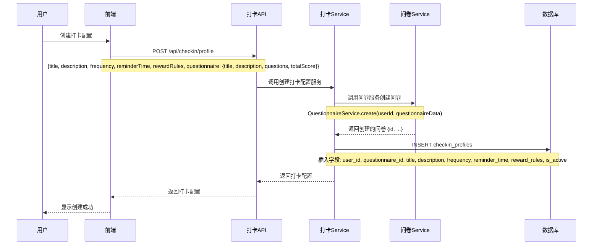
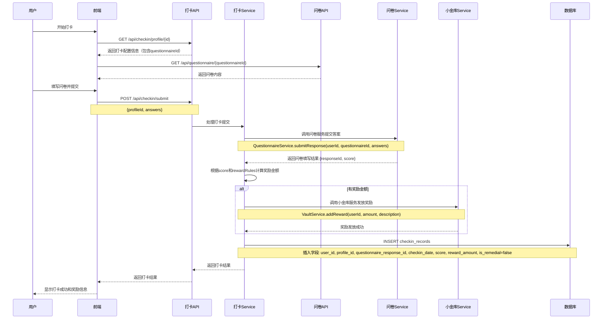
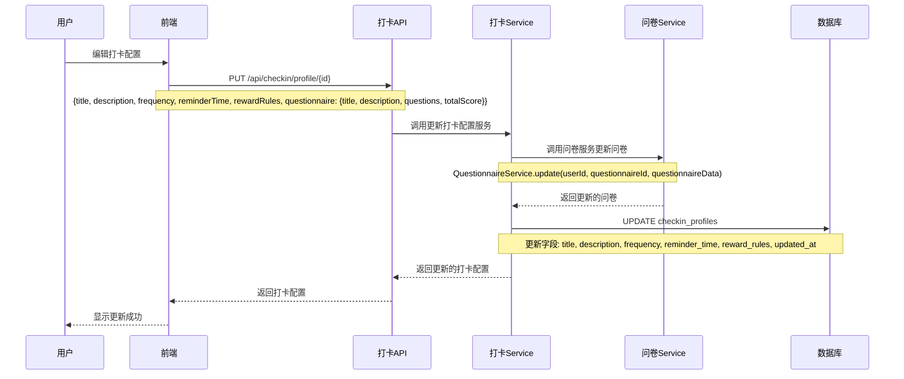
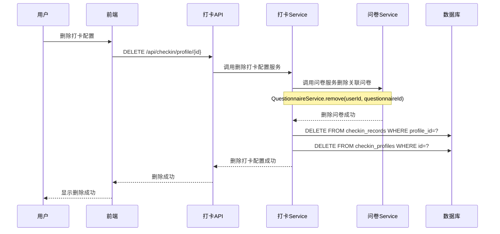
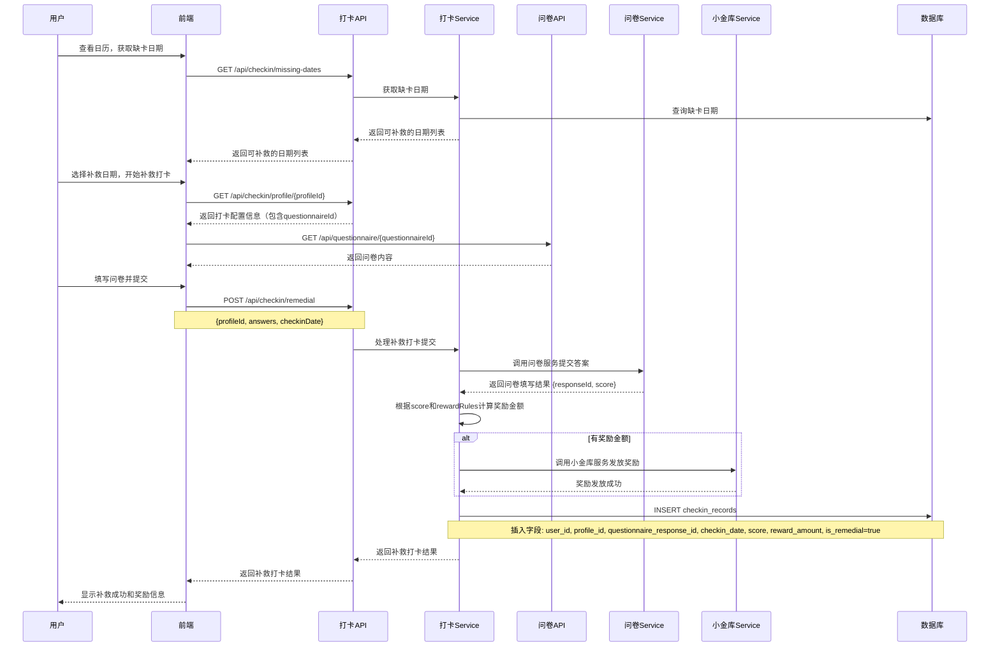

# 打卡模块设计

## 1. 需求分析

### 1.1 功能需求
- 用户可创建/编辑/删除打卡配置（同时管理关联的问卷）
- 支持多种打卡频率：每日、每周、自定义日期
- 创建打卡配置时同时创建专属问卷模板
- 根据问卷得分和奖励规则发放奖励
- 支持打卡补救功能
- 支持打卡提醒设置

### 1.2 业务规则
- 每个打卡配置自动创建一个专属问卷模板
- 打卡通过填写问卷完成，系统自动计算得分
- 根据得分阈值发放对应奖励金额
- 补救打卡无额外费用
- 支持一个提醒时间设置
- 删除打卡配置时同时删除关联问卷

## 2. 领域模型设计

### 2.1 核心实体

```typescript
// 打卡配置创建请求
interface CheckinProfileCreateRequest {
  title: string; // 打卡标题
  description: string; // 打卡描述
  frequency: CheckinFrequency; // 打卡频率
  reminderTime?: string; // 提醒时间 (HH:mm格式)
  rewardRules: CheckinRewardRule[]; // 奖励规则
  questionnaire: {
    questions: Question[]; // 问题列表
    totalScore: number; // 总分
  };
}

// 打卡配置
interface CheckinProfile {
  id: string; // 打卡配置ID
  userId: string; // 用户ID
  questionnaireId: string; // 关联问卷ID（自动创建）
  title: string; // 打卡标题
  description: string; // 打卡描述
  frequency: CheckinFrequency; // 打卡频率
  reminderTime?: string; // 提醒时间 (HH:mm格式)
  rewardRules: CheckinRewardRule[]; // 奖励规则
  isActive: boolean; // 是否启用
  createdAt: Date; // 创建时间
  updatedAt: Date; // 更新时间
}

// 打卡频率
interface CheckinFrequency {
  type: 'daily' | 'weekly' | 'custom'; // 频率类型
  weeklyDays?: number[]; // 每周打卡天数 (0-6，周日到周六)
  customDates?: string[]; // 自定义打卡日期 (ISO格式)
}

// 打卡奖励规则
interface CheckinRewardRule {
  threshold: number; // 分数阈值
  amount: number; // 奖励金额
}

// 打卡记录
interface CheckinRecord {
  id: string; // 记录ID
  userId: string; // 用户ID
  profileId: string; // 打卡配置ID
  questionnaireResponseId: string; // 关联问卷填写记录ID
  checkinDate: string; // 打卡日期 (YYYY-MM-DD)
  score: number; // 得分
  rewardAmount: number; // 获得奖励金额
  isRemedial: boolean; // 是否为补救打卡
  createdAt: Date; // 打卡时间
}
```

## 3. 数据库设计

### 3.1 数据表

```sql
CREATE TABLE checkin_profiles (
  id UUID PRIMARY KEY DEFAULT gen_random_uuid(),
  user_id UUID NOT NULL,
  questionnaire_id UUID NOT NULL,
  title VARCHAR(255) NOT NULL,
  description TEXT,
  frequency JSONB NOT NULL,
  reminder_time TIME,
  reward_rules JSONB NOT NULL,
  is_active BOOLEAN DEFAULT TRUE,
  created_at TIMESTAMP DEFAULT CURRENT_TIMESTAMP,
  updated_at TIMESTAMP DEFAULT CURRENT_TIMESTAMP,
  FOREIGN KEY (user_id) REFERENCES users(id),
  FOREIGN KEY (questionnaire_id) REFERENCES questionnaires(id) ON DELETE CASCADE
);

CREATE TABLE checkin_records (
  id UUID PRIMARY KEY DEFAULT gen_random_uuid(),
  user_id UUID NOT NULL,
  profile_id UUID NOT NULL,
  questionnaire_response_id UUID NOT NULL,
  checkin_date DATE NOT NULL,
  score INT NOT NULL,
  reward_amount DECIMAL(10, 2) NOT NULL,
  is_remedial BOOLEAN DEFAULT FALSE,
  created_at TIMESTAMP DEFAULT CURRENT_TIMESTAMP,
  FOREIGN KEY (user_id) REFERENCES users(id),
  FOREIGN KEY (profile_id) REFERENCES checkin_profiles(id),
  FOREIGN KEY (questionnaire_response_id) REFERENCES questionnaire_responses(id)
);
```

## 4. 业务流程设计

### 4.1 打卡配置创建流程



### 4.2 正常打卡流程



### 4.3 打卡配置编辑流程



### 4.4 打卡配置删除流程



### 4.5 补救打卡流程



## 5. API 设计

### 5.1 REST API 端点

```http
# 获取打卡配置列表
GET /api/checkin/profile

# 获取单个打卡配置
GET /api/checkin/profile/:id

# 创建打卡配置（同时创建问卷）
POST /api/checkin/profile
Content-Type: application/json
{
  "title": "每日健康打卡",
  "description": "记录每日健康状况",
  "frequency": {
    "type": "daily"
  },
  "reminderTime": "09:00",
  "rewardRules": [
    {"threshold": 80, "amount": 5},
    {"threshold": 90, "amount": 10}
  ],
  "questionnaire": {
    "title": "每日健康问卷",
    "description": "记录每日健康状况",
    "questions": [...],
    "totalScore": 100
  }
}

# 更新打卡配置（同时更新问卷）
PUT /api/checkin/profile/:id
Content-Type: application/json

# 删除打卡配置（同时删除问卷）
DELETE /api/checkin/profile/:id

# 提交打卡
POST /api/checkin/submit
Content-Type: application/json
{
  "profileId": "uuid",
  "answers": {
    "q1": "选项ID",
    "q2": ["选项ID1", "选项ID2"],
    "q3": "填空内容",
    "q4": 8
  }
}

# 提交补救打卡
POST /api/checkin/remedial
Content-Type: application/json
{
  "profileId": "uuid",
  "answers": {...},
  "checkinDate": "2025-06-25"
}

# 获取打卡记录
GET /api/checkin/records?profileId=&startDate=&endDate=&limit=&offset=

# 获取缺卡日期
GET /api/checkin/missing-dates?profileId=&days=
```

## 6. 服务层设计

```typescript
class CheckinService {
  constructor(
    private questionnaireService: QuestionnaireService,
    private vaultService: VaultService
  ) {}

  // 创建打卡配置（同时创建问卷）
  async createProfile(userId: string, data: CheckinProfileCreateRequest): Promise<CheckinProfile> {
    // 1. 先创建问卷
    const questionnaire = await this.questionnaireService.create(userId, {
      title: data.questionnaire.title,
      description: data.questionnaire.description,
      questions: data.questionnaire.questions,
      totalScore: data.questionnaire.totalScore,
    });

    // 2. 创建打卡配置
    const profileData = {
      userId,
      questionnaireId: questionnaire.id,
      title: data.title,
      description: data.description,
      frequency: data.frequency,
      reminderTime: data.reminderTime,
      rewardRules: data.rewardRules,
      isActive: true,
    };

    const profile = await this.createProfileRecord(profileData);
    return profile;
  }

  // 更新打卡配置（同时更新问卷）
  async updateProfile(userId: string, id: string, data: Partial<CheckinProfileCreateRequest>): Promise<CheckinProfile> {
    const existingProfile = await this.getProfile(userId, id);
    if (!existingProfile) throw new Error('打卡配置不存在');

    // 1. 如果有问卷更新，先更新问卷
    if (data.questionnaire) {
      await this.questionnaireService.update(userId, existingProfile.questionnaireId, {
        title: data.questionnaire.title,
        description: data.questionnaire.description,
        questions: data.questionnaire.questions,
        totalScore: data.questionnaire.totalScore,
      });
    }

    // 2. 更新打卡配置
    const updateData = {
      title: data.title,
      description: data.description,
      frequency: data.frequency,
      reminderTime: data.reminderTime,
      rewardRules: data.rewardRules,
    };

    const profile = await this.updateProfileRecord(userId, id, updateData);
    return profile;
  }

  // 删除打卡配置（同时删除问卷）
  async deleteProfile(userId: string, id: string): Promise<void> {
    const existingProfile = await this.getProfile(userId, id);
    if (!existingProfile) throw new Error('打卡配置不存在');

    // 1. 删除关联问卷（会级联删除问卷填写记录）
    await this.questionnaireService.remove(userId, existingProfile.questionnaireId);

    // 2. 删除打卡记录
    await this.deleteCheckinRecords(userId, id);

    // 3. 删除打卡配置
    await this.deleteProfileRecord(userId, id);
  }

  // 删除获取打卡问卷内容的方法，前端直接调用问卷API

  // 提交打卡
  async submitCheckin(userId: string, data: {
    profileId: string;
    answers: any;
  }): Promise<CheckinRecord> {
    const profile = await this.getProfile(userId, data.profileId);
    if (!profile) throw new Error('打卡配置不存在');

    // 1. 提交问卷答案
    const response = await this.questionnaireService.submitResponse(
      userId, 
      profile.questionnaireId, 
      data.answers
    );

    // 2. 计算奖励金额
    const rewardAmount = this.calculateReward(response.score, profile.rewardRules);

    // 3. 发放奖励
    if (rewardAmount > 0) {
      await this.vaultService.addReward(userId, rewardAmount, `打卡奖励: ${profile.title}`);
    }

    // 4. 保存打卡记录
    const checkinRecord = await this.createCheckinRecord({
      userId,
      profileId: data.profileId,
      questionnaireResponseId: response.id,
      checkinDate: new Date().toISOString().split('T')[0],
      score: response.score,
      rewardAmount,
      isRemedial: false,
    });

    return checkinRecord;
  }

  // 提交补救打卡
  async submitRemedialCheckin(userId: string, data: {
    profileId: string;
    answers: any;
    checkinDate: string;
  }): Promise<CheckinRecord> {
    const profile = await this.getProfile(userId, data.profileId);
    if (!profile) throw new Error('打卡配置不存在');

    // 1. 提交问卷答案
    const response = await this.questionnaireService.submitResponse(
      userId, 
      profile.questionnaireId, 
      data.answers
    );

    // 2. 计算奖励金额
    const rewardAmount = this.calculateReward(response.score, profile.rewardRules);

    // 3. 发放奖励
    if (rewardAmount > 0) {
      await this.vaultService.addReward(userId, rewardAmount, `补救打卡奖励: ${profile.title}`);
    }

    // 4. 保存打卡记录
    const checkinRecord = await this.createCheckinRecord({
      userId,
      profileId: data.profileId,
      questionnaireResponseId: response.id,
      checkinDate: data.checkinDate,
      score: response.score,
      rewardAmount,
      isRemedial: true,
    });

    return checkinRecord;
  }

  // 其他方法...
  async getProfiles(userId: string): Promise<CheckinProfile[]>;
  async getProfile(userId: string, id: string): Promise<CheckinProfile | null>;
  async getRecords(userId: string, options?: any): Promise<{ records: CheckinRecord[]; total: number }>;
  async getMissingDates(userId: string, profileId: string, days: number): Promise<string[]>;
  
  // 私有方法
  private calculateReward(score: number, rules: CheckinRewardRule[]): number;
  private shouldCheckinToday(frequency: CheckinFrequency, date: Date): boolean;
  private async createProfileRecord(data: any): Promise<CheckinProfile>;
  private async updateProfileRecord(userId: string, id: string, data: any): Promise<CheckinProfile>;
  private async deleteProfileRecord(userId: string, id: string): Promise<void>;
  private async createCheckinRecord(data: any): Promise<CheckinRecord>;
  private async deleteCheckinRecords(userId: string, profileId: string): Promise<void>;
}
```

## 7. 前端组件设计

### 7.1 组件结构

```
src/components/checkin/
├── CheckinProfileCard.tsx        # 打卡配置卡片
├── CheckinProfileEditor.tsx      # 打卡配置编辑器（集成问卷编辑）
├── CheckinProfileList.tsx        # 打卡配置列表
├── CheckinDialog.tsx             # 打卡弹窗
├── CheckinCalendar.tsx           # 打卡日历
├── CheckinRecordList.tsx         # 打卡记录列表
├── CheckinQuestionnaireEditor.tsx # 问卷编辑组件（内嵌）
└── index.ts
```

### 7.2 状态管理

- 使用 React Query 管理服务端状态
- 参考问卷模块和小金库模块的 useQuery/useMutation 方案

## 8. 集成设计

### 8.1 内部服务集成
- **问卷模块集成**：通过 QuestionnaireService 直接调用
  - 输入：questionnaire 数据
  - 输出：创建的问卷 ID 和内容
- **小金库模块集成**：通过 VaultService 直接调用  
  - 输入：amount, description
  - 输出：交易记录

### 8.2 数据一致性
- 打卡配置与问卷强关联，删除时级联删除
- 事务操作确保数据一致性
- 错误回滚机制