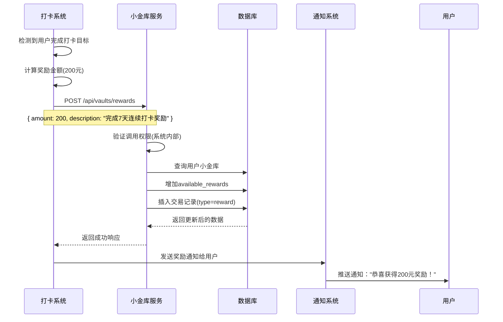
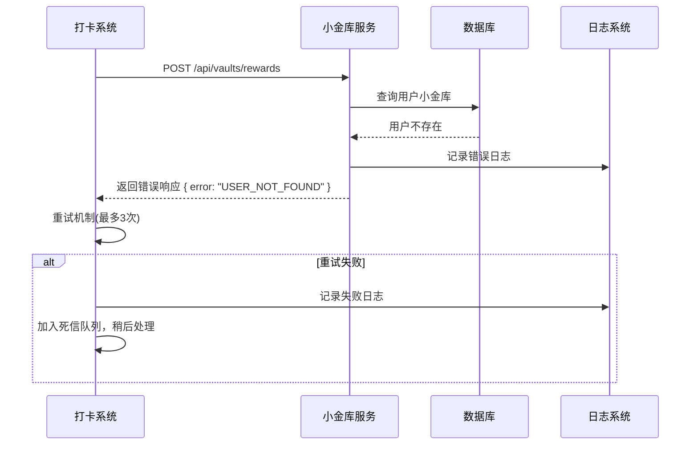

# XXX功能设计

## 功能概述
简要说明该功能的整体目标和价值。

### 核心特性
- **特性1**：描述核心功能点，例如：用户可以设置每日打卡目标
- **特性2**：描述另一个核心功能，例如：系统自动统计打卡天数并发放奖励
- **特性3**：支持的操作类型，例如：支持手动打卡和自动检测打卡

### 关键概念
- **概念1**：定义关键业务概念，例如：连续打卡天数 - 用户连续完成打卡的天数，中断后重新计算
- **概念2**：另一个重要概念，例如：奖励池 - 用户可获得的奖励总额，由系统根据打卡表现发放
- **概念3**：核心业务逻辑，例如：打卡窗口 - 每日0点到23:59:59为有效打卡时间窗口

## 架构设计原则
### 前后端分离
- **前端页面**：只负责UI展示和用户交互，不直接访问数据库
- **API接口**：后端提供RESTful API，处理业务逻辑和数据访问
- **数据库**：只有后端服务可以直接访问，确保数据安全和一致性

### 分层架构
- **表现层**：前端页面和组件
- **API层**：HTTP接口和路由处理
- **业务层**：业务逻辑和服务类
- **数据层**：数据库访问和数据模型

### 数据流向
```
前端页面 → API接口 → 业务服务 → 数据库
       ←        ←        ←
```

## 用户角色和权限
### 角色定义
- **普通用户**：可以查看自己的数据，进行基本操作
- **管理员**：可以查看所有用户数据，进行管理操作
- **系统**：内部系统调用，拥有特殊权限

### 权限矩阵
| 操作 | 普通用户 | 管理员 | 系统 |
|------|----------|--------|------|
| 查看个人数据 | ✅ | ✅ | ✅ |
| 修改个人数据 | ✅ | ✅ | ✅ |
| 查看他人数据 | ❌ | ✅ | ✅ |
| 系统操作 | ❌ | ❌ | ✅ |

## 业务规则
定义核心业务约束和规则，确保系统行为的一致性。

### 基本规则
- 小金库金额上限：10,000 元
- 奖励金额必须为正数
- 设置金额会替换原有金额，不是累加
- 奖励发放会增加 `available_rewards` 字段
- 所有交易都会记录在 `vault_transactions` 表中

### 业务约束
- **时间约束**：每日打卡窗口为0:00-23:59
- **频率约束**：每用户每日最多只能打卡一次
- **金额约束**：单次奖励金额不能超过1000元
- **状态约束**：已删除的记录不能被修改

### 计算规则
- **奖励计算**：连续打卡天数 × 基础奖励(10元) × 倍数系数
- **等级计算**：根据累计打卡天数确定用户等级
- **统计规则**：只统计状态为"已完成"的打卡记录

### 异常处理规则
- **重复操作**：相同操作在5分钟内重复提交，返回原结果
- **并发处理**：使用乐观锁防止并发修改冲突
- **数据恢复**：删除操作支持30天内恢复

## 业务流程
描述核心业务场景的完整流程，包括正常流程和异常处理。

### 主要业务流程
交互场景与mermaid序列图,如：
````example
### 系统发放奖励


````

### 异常流程处理
````example
### 奖励发放失败处理


````

### 边界条件
- **上限检查**：奖励金额超过上限时的处理
- **并发控制**：同时多个请求修改同一用户数据
- **网络异常**：请求超时或网络中断的处理
- **数据异常**：数据库操作失败的回滚机制


## 数据库设计

### 表结构设计
根据业务需求设计数据库表结构，遵循规范化原则。

### 示例：用户小金库表
```sql
-- 用户小金库表
CREATE TABLE user_vaults (
    id UUID PRIMARY KEY DEFAULT gen_random_uuid(),
    user_id UUID NOT NULL,
    total_amount DECIMAL(10,2) NOT NULL DEFAULT 0.00,
    available_rewards DECIMAL(10,2) NOT NULL DEFAULT 0.00,
    created_at TIMESTAMP WITH TIME ZONE DEFAULT NOW(),
    updated_at TIMESTAMP WITH TIME ZONE DEFAULT NOW(),
    version INTEGER DEFAULT 1 -- 乐观锁版本号
);

-- 小金库交易记录表
CREATE TABLE vault_transactions (
    id UUID PRIMARY KEY DEFAULT gen_random_uuid(),
    user_id UUID NOT NULL,
    vault_id UUID NOT NULL,
    transaction_type VARCHAR(20) NOT NULL, -- 'reward', 'withdraw', 'penalty'
    amount DECIMAL(10,2) NOT NULL,
    description TEXT,
    status VARCHAR(20) DEFAULT 'completed', -- 'pending', 'completed', 'failed'
    created_at TIMESTAMP WITH TIME ZONE DEFAULT NOW(),
    created_by UUID -- 操作人ID，系统操作为NULL
);
```

### 索引设计
```sql
-- 性能优化索引
CREATE INDEX idx_user_vaults_user_id ON user_vaults(user_id);
CREATE INDEX idx_vault_transactions_user_id ON vault_transactions(user_id);
CREATE INDEX idx_vault_transactions_created_at ON vault_transactions(created_at);
CREATE INDEX idx_vault_transactions_type ON vault_transactions(transaction_type);
```

### 数据约束
```sql
-- 业务约束
ALTER TABLE user_vaults ADD CONSTRAINT chk_total_amount_positive CHECK (total_amount >= 0);
ALTER TABLE user_vaults ADD CONSTRAINT chk_available_rewards_positive CHECK (available_rewards >= 0);
ALTER TABLE user_vaults ADD CONSTRAINT chk_total_amount_limit CHECK (total_amount <= 10000.00);

ALTER TABLE vault_transactions ADD CONSTRAINT chk_transaction_type 
    CHECK (transaction_type IN ('reward', 'withdraw', 'penalty', 'adjustment'));
ALTER TABLE vault_transactions ADD CONSTRAINT chk_status 
    CHECK (status IN ('pending', 'completed', 'failed', 'cancelled'));
```

## HTTP Restful API接口设计
定义清晰的API接口规范，包括认证、错误码、请求响应格式等。

### 模块编号
模块号：`VAULT` (小金库模块)

### 认证方式
- **用户认证**：Bearer Token (JWT)
- **系统调用**：API Key + 签名验证
- **管理员操作**：Bearer Token + Admin Role

### 通用错误代码
| 错误码 | HTTP状态码 | 描述 |
|--------|------------|------|
| INVALID_REQUEST | 400 | 请求参数错误 |
| UNAUTHORIZED | 401 | 未授权访问 |
| FORBIDDEN | 403 | 权限不足 |
| NOT_FOUND | 404 | 资源不存在 |
| CONFLICT | 409 | 数据冲突 |
| INTERNAL_ERROR | 500 | 服务器内部错误 |

### 业务错误代码
| 错误码 | HTTP状态码 | 描述 |
|--------|------------|------|
| VAULT_NOT_FOUND | 404 | 用户小金库不存在 |
| INSUFFICIENT_BALANCE | 400 | 余额不足 |
| AMOUNT_LIMIT_EXCEEDED | 400 | 金额超过限制 |
| DUPLICATE_TRANSACTION | 409 | 重复交易 |

### API接口定义

#### 获取用户小金库信息
```http
GET /api/vaults/{userId}
Authorization: Bearer {token}

Response 200:
{
  "id": "uuid",
  "userId": "uuid", 
  "totalAmount": 1500.00,
  "availableRewards": 300.00,
  "createdAt": "2024-01-01T00:00:00Z",
  "updatedAt": "2024-01-01T00:00:00Z"
}

Response 404:
{
  "error": "VAULT_NOT_FOUND",
  "message": "用户小金库不存在"
}
```

#### 发放奖励
```http
POST /api/vaults/{userId}/rewards
Authorization: Bearer {token}
Content-Type: application/json

Request Body:
{
  "amount": 200.00,
  "description": "完成7天连续打卡奖励",
  "transactionId": "unique-transaction-id" // 幂等性保证
}

Response 200:
{
  "transactionId": "uuid",
  "amount": 200.00,
  "newBalance": 1700.00,
  "description": "完成7天连续打卡奖励",
  "createdAt": "2024-01-01T00:00:00Z"
}

Response 400:
{
  "error": "AMOUNT_LIMIT_EXCEEDED", 
  "message": "奖励金额超过单次限制"
}
```

#### 查询交易记录
```http
GET /api/vaults/{userId}/transactions?page=1&limit=20&type=reward
Authorization: Bearer {token}

Response 200:
{
  "data": [
    {
      "id": "uuid",
      "transactionType": "reward",
      "amount": 200.00,
      "description": "完成7天连续打卡奖励",
      "status": "completed",
      "createdAt": "2024-01-01T00:00:00Z"
    }
  ],
  "pagination": {
    "page": 1,
    "limit": 20,
    "total": 50,
    "totalPages": 3
  }
}
```

### 数据验证规则
- **用户ID**：必须是有效的UUID格式
- **金额**：必须是正数，最多2位小数，范围0.01-10000.00
- **描述**：可选，最大长度500字符
- **交易类型**：必须是预定义的枚举值
- **分页参数**：page >= 1, limit 范围 1-100

## TypeScript 类型定义

### 数据库模型类型
定义与数据库表结构对应的类型，使用下划线命名。

```typescript
// 数据库原始类型 - 下划线命名风格
interface UserVaultDB {
  id: string;
  user_id: string;
  total_amount: number;
  available_rewards: number;
  created_at: string;
  updated_at: string;
  version: number;
}

interface VaultTransactionDB {
  id: string;
  user_id: string;
  vault_id: string;
  transaction_type: 'reward' | 'withdraw' | 'penalty' | 'adjustment';
  amount: number;
  description: string | null;
  status: 'pending' | 'completed' | 'failed' | 'cancelled';
  created_at: string;
  created_by: string | null;
}
```

### 业务模型类型
定义业务逻辑中使用的类型，使用驼峰命名。

```typescript
// 业务模型类型 - 驼峰命名风格
interface UserVault {
  id: string;
  userId: string;
  totalAmount: number;
  availableRewards: number;
  createdAt: Date;
  updatedAt: Date;
  version: number;
}

interface VaultTransaction {
  id: string;
  userId: string;
  vaultId: string;
  transactionType: TransactionType;
  amount: number;
  description: string | null;
  status: TransactionStatus;
  createdAt: Date;
  createdBy: string | null;
}

// 枚举类型
enum TransactionType {
  REWARD = 'reward',
  WITHDRAW = 'withdraw', 
  PENALTY = 'penalty',
  ADJUSTMENT = 'adjustment'
}

enum TransactionStatus {
  PENDING = 'pending',
  COMPLETED = 'completed',
  FAILED = 'failed',
  CANCELLED = 'cancelled'
}
```

### 类型转换函数
提供数据库类型和业务类型之间的转换。

```typescript
// 数据库类型转业务类型
function dbToUserVault(dbVault: UserVaultDB): UserVault {
  return {
    id: dbVault.id,
    userId: dbVault.user_id,
    totalAmount: dbVault.total_amount,
    availableRewards: dbVault.available_rewards,
    createdAt: new Date(dbVault.created_at),
    updatedAt: new Date(dbVault.updated_at),
    version: dbVault.version
  };
}

// 业务类型转数据库类型
function userVaultToDb(vault: Partial<UserVault>): Partial<UserVaultDB> {
  return {
    ...(vault.id && { id: vault.id }),
    ...(vault.userId && { user_id: vault.userId }),
    ...(vault.totalAmount !== undefined && { total_amount: vault.totalAmount }),
    ...(vault.availableRewards !== undefined && { available_rewards: vault.availableRewards }),
    ...(vault.version !== undefined && { version: vault.version })
  };
}
```

### 请求/响应类型
定义API接口的请求和响应类型。

```typescript
// 请求类型
interface CreateRewardRequest {
  amount: number;
  description: string;
  transactionId?: string; // 幂等性保证
}

interface GetTransactionsQuery {
  page?: number;
  limit?: number;
  type?: TransactionType;
  status?: TransactionStatus;
  startDate?: string;
  endDate?: string;
}

// 响应类型
interface VaultResponse {
  id: string;
  userId: string;
  totalAmount: number;
  availableRewards: number;
  createdAt: string;
  updatedAt: string;
}

interface TransactionResponse {
  id: string;
  transactionType: TransactionType;
  amount: number;
  description: string | null;
  status: TransactionStatus;
  createdAt: string;
}

interface PaginatedResponse<T> {
  data: T[];
  pagination: {
    page: number;
    limit: number;
    total: number;
    totalPages: number;
  };
}

// 错误响应类型
interface ErrorResponse {
  error: string;
  message: string;
  details?: Record<string, any>;
}
```

### 验证类型
定义数据验证相关的类型。

```typescript
// 验证规则类型
interface ValidationRule {
  required?: boolean;
  min?: number;
  max?: number;
  pattern?: RegExp;
  custom?: (value: any) => boolean | string;
}

interface ValidationSchema {
  [key: string]: ValidationRule;
}

// 验证结果类型
interface ValidationResult {
  isValid: boolean;
  errors: Record<string, string>;
}
```

### 核心服务类设计
定义主要的服务类结构和核心方法。

```typescript
// 小金库服务类
class VaultService {
  constructor(
    private supabaseClient: SupabaseClient,
    private logger: Logger
  ) {}

  /**
   * 获取用户小金库信息
   * @param userId 用户ID
   * @returns 用户小金库信息
   */
  async getUserVault(userId: string): Promise<UserVault | null> {
    // 实现逻辑
  }

  /**
   * 发放奖励
   * @param userId 用户ID
   * @param request 奖励请求
   * @returns 交易记录
   */
  async issueReward(
    userId: string, 
    request: CreateRewardRequest
  ): Promise<VaultTransaction> {
    // 实现逻辑
  }

  /**
   * 查询交易记录
   * @param userId 用户ID
   * @param query 查询条件
   * @returns 分页的交易记录
   */
  async getTransactions(
    userId: string,
    query: GetTransactionsQuery
  ): Promise<PaginatedResponse<VaultTransaction>> {
    // 实现逻辑
  }

  /**
   * 创建用户小金库
   * @param userId 用户ID
   * @returns 新创建的小金库
   */
  async createVault(userId: string): Promise<UserVault> {
    // 实现逻辑
  }

  // 私有方法
  private async validateAmount(amount: number): Promise<void> {
    // 验证金额
  }

  private async checkConcurrency(vaultId: string, version: number): Promise<void> {
    // 乐观锁检查
  }
}

// 验证服务类
class ValidationService {
  static validateCreateRewardRequest(request: CreateRewardRequest): ValidationResult {
    const schema: ValidationSchema = {
      amount: { 
        required: true, 
        min: 0.01, 
        max: 1000.00 
      },
      description: { 
        required: true,
        pattern: /^.{1,500}$/
      }
    };
    
    return this.validateObject(request, schema);
  }

  private static validateObject(obj: any, schema: ValidationSchema): ValidationResult {
    // 实现验证逻辑
  }
}

// 工具类
class VaultUtils {
  /**
   * 格式化金额显示
   * @param amount 金额
   * @returns 格式化后的金额字符串
   */
  static formatAmount(amount: number): string {
    return `¥${amount.toFixed(2)}`;
  }

  /**
   * 生成交易ID
   * @returns 唯一的交易ID
   */
  static generateTransactionId(): string {
    return `txn_${Date.now()}_${Math.random().toString(36).substr(2, 9)}`;
  }

  /**
   * 检查是否为有效的UUID
   * @param id 待检查的ID
   * @returns 是否为有效UUID
   */
  static isValidUUID(id: string): boolean {
    const uuidRegex = /^[0-9a-f]{8}-[0-9a-f]{4}-[1-5][0-9a-f]{3}-[89ab][0-9a-f]{3}-[0-9a-f]{12}$/i;
    return uuidRegex.test(id);
  }
}
```

## 测试用例设计
定义核心功能的测试场景，确保功能正确性。

### 单元测试用例
```typescript
describe('VaultService', () => {
  describe('issueReward', () => {
    it('应该成功发放奖励', async () => {
      // 测试正常发放奖励
    });

    it('应该拒绝无效金额', async () => {
      // 测试金额验证
    });

    it('应该处理并发冲突', async () => {
      // 测试乐观锁
    });

    it('应该保证幂等性', async () => {
      // 测试重复请求
    });
  });
});
```

### 集成测试场景
- **端到端奖励流程**：从打卡完成到奖励到账的完整流程
- **错误恢复测试**：网络中断、数据库异常等情况的处理
- **性能测试**：高并发场景下的系统表现
- **安全测试**：权限验证、数据安全等

## 性能要求
定义系统的性能指标和优化策略。

### 响应时间要求
- **查询操作**：< 200ms (95分位)
- **写入操作**：< 500ms (95分位)
- **复杂查询**：< 1000ms (95分位)

### 并发要求
- **同时在线用户**：10,000+
- **每秒请求数**：1,000+ QPS
- **数据库连接池**：50-100个连接

### 优化策略
- **缓存策略**：热点数据使用Redis缓存
- **数据库优化**：合理使用索引，避免N+1查询
- **异步处理**：非关键路径使用消息队列

## 监控和日志设计
定义系统监控指标和日志策略。

### 关键指标监控
- **业务指标**：每日奖励发放总额、用户活跃度
- **技术指标**：API响应时间、错误率、数据库连接数
- **异常指标**：失败交易数、并发冲突数

### 日志级别定义
- **INFO**：正常业务操作
- **WARN**：可恢复的异常情况
- **ERROR**：需要人工介入的错误
- **DEBUG**：详细的调试信息

### 告警规则
- **错误率 > 5%**：立即告警
- **响应时间 > 2s**：5分钟内告警
- **数据库连接数 > 80%**：预警通知

## 安全考虑
定义系统安全相关的设计和实现。

### 数据安全
- **敏感数据加密**：用户ID、金额等敏感信息
- **SQL注入防护**：使用参数化查询
- **输入验证**：严格验证所有输入参数

### 访问控制
- **身份认证**：JWT Token验证
- **权限控制**：基于角色的访问控制(RBAC)
- **API限流**：防止接口滥用

### 操作审计
- **操作日志**：记录所有关键操作
- **数据变更追踪**：记录数据修改历史
- **异常行为监控**：检测可疑操作

## 部署和运维
定义系统部署和运维相关的考虑。

### 环境配置
- **开发环境**：本地开发和测试
- **测试环境**：集成测试和用户验收测试
- **生产环境**：正式服务环境

### 配置管理
- **环境变量**：数据库连接、API密钥等配置
- **功能开关**：支持动态开启/关闭功能
- **配置热更新**：支持不重启更新配置

### 备份策略
- **数据备份**：每日自动备份数据库
- **配置备份**：版本控制管理配置文件
- **灾难恢复**：制定数据恢复预案