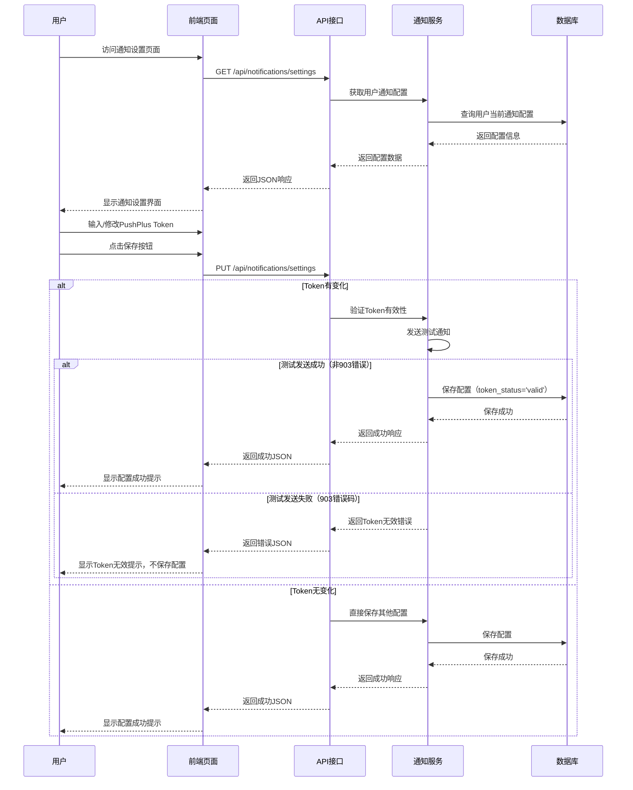
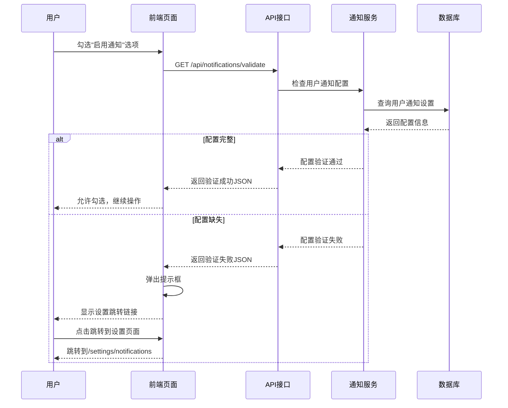
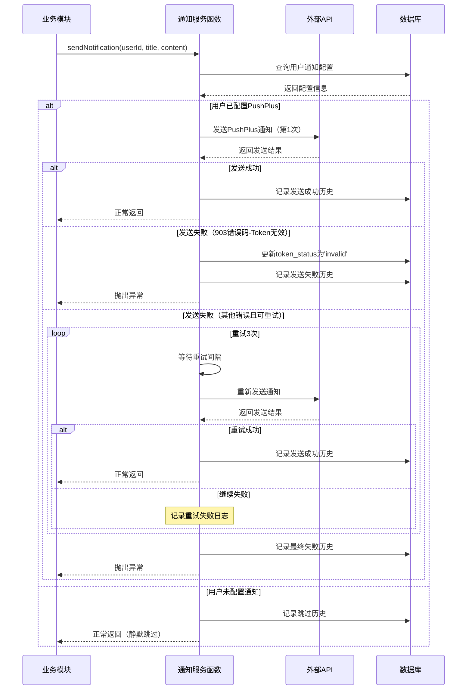

# 消息通知模块设计

## 功能概述
消息通知模块为系统提供统一的消息推送服务，支持PushPlus通知渠道，确保用户能够及时收到重要的系统通知。

### 核心特性
- **PushPlus支持**：支持PushPlus通知方式，其他方式（短信、邮箱）暂不支持
- **配置管理**：用户可在通知设置页面配置PushPlus Token
- **业务集成**：与其他模块无缝集成，提供内部调用接口
- **智能验证**：在启用通知功能前自动检查用户配置完整性
- **直接发送**：调用方直接提供完整的标题和内容，无需模板处理
- **重试机制**：发送失败时自动重试，确保消息可靠送达

### 关键概念
- **通知渠道**：当前仅支持pushplus（PushPlus）
- **PushPlus Token**：用户在PushPlus平台申请的推送凭据，用于身份验证和消息发送
- **通知配置**：用户的通知偏好设置，包括Token和启用状态
- **重试策略**：发送失败时的重试机制，采用指数退避算法，最多重试3次

## 架构设计原则
### 前后端分离
- **前端页面**：只负责UI展示和用户交互，不直接访问数据库
- **API接口**：后端提供RESTful API，处理业务逻辑和数据访问
- **数据库**：只有后端服务可以直接访问，确保数据安全和一致性

### 分层架构
- **表现层**：前端页面和组件（通知设置页面）
- **API层**：HTTP接口和路由处理（/api/notifications）
- **业务层**：业务逻辑和服务类（NotificationService）
- **数据层**：数据库访问和数据模型

### 数据流向
```
前端页面 → API接口 → 业务服务 → 数据库
       ←        ←        ←
```

## 用户角色和权限
### 角色定义
- **普通用户**：可以配置自己的通知设置，接收系统通知
- **系统**：内部系统调用，拥有发送通知的权限

### 权限矩阵
| 操作 | 普通用户 | 系统 |
|------|----------|------|
| 配置通知设置 | ✅ | ❌ |
| 发送通知 | ❌ | ✅ |
| 查看通知历史 | ✅ | ❌ |

## 业务规则
定义核心业务约束和规则，确保通知系统的稳定性和可靠性。

### 基本规则
- PushPlus Token为可选项，但在其它模块中启用通知前必须验证配置完整性
- 通知发送失败时记录错误日志，启动重试机制
- 所有通知发送记录都保存到数据库中，包括成功和失败的记录
- 用户保存通知设置，且pushplus_token有变化时，要尝试用这个token发送一条通知，来判断这个token的可用性

### 业务约束
- **配置约束**：用户必须在通知设置界面完成通知配置才能启用相关功能
- **权限约束**：只有系统内部API可以调用通知发送接口

### 验证规则
- **PushPlus Token验证**：必须为有效的Token，通过保存时发送测试通知验证

### 重试规则
- **重试次数**：最多重试3次
- **重试间隔**：指数退避，1秒、2秒、4秒
- **重试条件**：客户端错误（4xx）不重试
- **最终失败处理**：重试3次后仍失败，标记为失败并日志打印详细错误信息

### 异常处理规则
- **网络异常**：通知发送失败时记录日志，启动重试机制
- **配置缺失**：提供友好的错误提示和设置跳转链接
- **Token失效处理**：
  - 保存Token时：如果验证失败（PushPlus返回903错误码），则不保存Token，直接返回错误
  - 发送通知时：如果遇到903错误码，则更新数据库中token_status为'invalid'，下次用户访问dashboard时提醒

## 业务流程
描述核心业务场景的完整流程，包括正常流程和异常处理。

### 主要业务流程

#### 用户配置通知设置



#### 其他模块启用通知验证



#### 系统发送通知（直接函数调用）



### 边界条件
- **并发发送**：多个模块同时发送通知时的队列处理
- **配置变更**：用户修改通知设置时对进行中的发送任务的影响
- **服务降级**：PushPlus服务不可用时的处理策略
- **数据一致性**：通知配置更新与业务数据的一致性保证
- **历史清理**：通知历史记录的定期清理策略

## 数据库设计

### 表结构设计
根据业务需求设计通知相关的数据库表结构。

### 用户通知配置表
```sql
-- 用户通知配置表
CREATE TABLE user_notification_settings (
    id UUID PRIMARY KEY DEFAULT gen_random_uuid(),
    user_id UUID NOT NULL,
    pushplus_token VARCHAR(500), -- PushPlus Token
    pushplus_enabled BOOLEAN DEFAULT FALSE, -- PushPlus是否启用
    token_status VARCHAR(20) DEFAULT 'valid', -- Token状态：valid, invalid, expired
    created_at TIMESTAMP WITH TIME ZONE DEFAULT NOW(),
    updated_at TIMESTAMP WITH TIME ZONE DEFAULT NOW(),
    UNIQUE(user_id)
);

-- 通知发送历史表
CREATE TABLE notification_logs (
    id UUID PRIMARY KEY DEFAULT gen_random_uuid(),
    user_id UUID NOT NULL,
    channel VARCHAR(20) NOT NULL, -- 发送渠道：pushplus
    title VARCHAR(200) NOT NULL, -- 实际发送的标题
    content TEXT NOT NULL, -- 实际发送的内容
    status VARCHAR(20) NOT NULL, -- 发送状态：success, failed, skipped
    retry_count INTEGER DEFAULT 0, -- 重试次数
    error_message TEXT, -- 错误信息
    sent_at TIMESTAMP WITH TIME ZONE DEFAULT NOW(),
    response_data JSONB -- API响应数据
);
```

### 索引设计
```sql
-- 性能优化索引
CREATE INDEX idx_user_notification_settings_user_id ON user_notification_settings(user_id);
CREATE INDEX idx_notification_logs_user_id ON notification_logs(user_id);
```

### 数据约束
```sql
-- 业务约束
ALTER TABLE user_notification_settings ADD CONSTRAINT chk_token_status 
    CHECK (token_status IN ('valid', 'invalid', 'expired'));
ALTER TABLE notification_logs ADD CONSTRAINT chk_channel 
    CHECK (channel IN ('pushplus'));
ALTER TABLE notification_logs ADD CONSTRAINT chk_status 
    CHECK (status IN ('success', 'failed', 'skipped'));

-- 启用 RLS
ALTER TABLE user_notification_settings ENABLE ROW LEVEL SECURITY;
ALTER TABLE notification_logs ENABLE ROW LEVEL SECURITY;

-- user_notification_settings 表策略：用户只能访问自己的通知设置
CREATE POLICY "用户只能访问自己的通知设置" ON user_notification_settings
  FOR ALL USING (auth.uid() = user_id);

-- notification_logs 表策略：用户只能访问自己的通知历史
CREATE POLICY "用户只能访问自己的通知历史" ON notification_logs
  FOR ALL USING (auth.uid() = user_id);
```

## 内部模块调用设计
消息通知模块提供函数调用接口，其他模块直接import使用。

### 服务函数设计
```typescript
// src/lib/services/notification.ts
import { createClientComponentClient } from '@supabase/auth-helpers-nextjs'

/**
 * 发送通知
 * @param userId 用户ID
 * @param title 通知标题
 * @param content 通知内容
 * @throws Error 发送失败时抛出异常
 */
export async function sendNotification(
  userId: string,
  title: string,
  content: string
): Promise<void> {
  const supabase = createClientComponentClient()
  
  // 查询用户通知配置
  const { data: settings } = await supabase
    .from('user_notification_settings')
    .select('*')
    .eq('user_id', userId)
    .single()

  if (!settings?.pushplus_enabled || !settings.pushplus_token) {
    // 记录跳过日志
    await logNotification(userId, 'pushplus', title, content, 'skipped', 0, '用户未启用通知')
    return
  }

  // 发送通知（带重试）
  await sendWithRetry(settings.pushplus_token, title, content, userId)
}

/**
 * 验证用户通知配置
 * @param userId 用户ID
 * @returns 配置验证结果
 */
export async function validateUserNotificationConfig(
  userId: string
): Promise<NotificationConfigValidation> {
  const supabase = createClientComponentClient()
  
  const { data: settings } = await supabase
    .from('user_notification_settings')
    .select('*')
    .eq('user_id', userId)
    .single()

  const availableChannels: NotificationChannel[] = []
  const missingConfigs: string[] = []

  if (settings?.pushplus_enabled && settings.pushplus_token) {
    availableChannels.push(NotificationChannel.PUSHPLUS)
  } else {
    missingConfigs.push('PushPlus Token')
  }

  return {
    isValid: availableChannels.length > 0,
    availableChannels,
    missingConfigs
  }
}

// 私有函数
async function sendWithRetry(
  token: string,
  title: string,
  content: string,
  userId: string,
  retryCount = 0
): Promise<void> {
  try {
    const response = await fetch('http://www.pushplus.plus/send', {
      method: 'POST',
      headers: { 'Content-Type': 'application/json' },
      body: JSON.stringify({
        token,
        title,
        content,
        template: 'html'
      })
    })

    const result = await response.json()
    
    if (result.code === 200) {
      await logNotification(userId, 'pushplus', title, content, 'success', retryCount)
      return
    } else if (result.code === 903) {
      // Token无效，更新状态
      await updateTokenStatus(userId, 'invalid')
      await logNotification(userId, 'pushplus', title, content, 'failed', retryCount, 'Token无效')
      throw new Error(`Token无效: ${result.msg}`)
    } else {
      throw new Error(`发送失败: ${result.msg}`)
    }
  } catch (error) {
    if (retryCount < 3 && shouldRetry(error)) {
      await delay(Math.pow(2, retryCount) * 1000)
      return sendWithRetry(token, title, content, userId, retryCount + 1)
    } else {
      await logNotification(userId, 'pushplus', title, content, 'failed', retryCount, (error as Error).message)
      throw error
    }
  }
}

async function shouldRetry(error: any): Promise<boolean> {
  // 网络错误或服务器错误才重试，Token无效不重试
  return !error.message.includes('Token无效')
}

async function delay(ms: number): Promise<void> {
  return new Promise(resolve => setTimeout(resolve, ms))
}

async function logNotification(
  userId: string,
  channel: string,
  title: string,
  content: string,
  status: string,
  retryCount: number,
  errorMessage?: string
): Promise<void> {
  const supabase = createClientComponentClient()
  
  await supabase
    .from('notification_logs')
    .insert({
      user_id: userId,
      channel,
      title,
      content,
      status,
      retry_count: retryCount,
      error_message: errorMessage
    })
}

async function updateTokenStatus(userId: string, status: string): Promise<void> {
  const supabase = createClientComponentClient()
  
  await supabase
    .from('user_notification_settings')
    .update({ token_status: status })
    .eq('user_id', userId)
}
```

### 模块调用示例
```typescript
// 在checkinService中调用
import { sendNotification } from '@/lib/services/notification'

export async function sendCheckinReminder(userId: string): Promise<void> {
  try {
    await sendNotification(
      userId,
      '⏰ 别忘了今天的打卡哦！',
      '今天还没有完成打卡，记得完成你的目标哦！'
    )
  } catch (error) {
    console.error('发送打卡提醒失败:', error)
    // 不阻塞主业务流程，只记录错误
  }
}

// 在问卷模块中验证配置
import { validateUserNotificationConfig } from '@/lib/services/notification'

export async function enableNotificationForQuestionnaire(userId: string): Promise<boolean> {
  const validation = await validateUserNotificationConfig(userId)
  
  if (!validation.isValid) {
    throw new Error(`通知配置不完整: ${validation.missingConfigs.join(', ')}`)
  }
  
  return true
}
```

## HTTP Restful API接口设计
定义用户相关的API接口规范，系统内部调用使用直接函数调用。

### 认证方式
- **用户认证**：Supabase Cookie 认证（自动处理）

### 通用错误代码
| 错误码 | HTTP状态码 | 描述 |
|--------|------------|------|
| INVALID_REQUEST | 400 | 请求参数错误 |
| UNAUTHORIZED | 401 | 未授权访问 |
| FORBIDDEN | 403 | 权限不足 |
| NOT_FOUND | 404 | 资源不存在 |
| INTERNAL_ERROR | 500 | 服务器内部错误 |

### 业务错误代码
| 错误码 | HTTP状态码 | 描述 |
|--------|------------|------|
| SETTINGS_NOT_FOUND | 404 | 用户通知设置不存在 |
| INVALID_TOKEN | 400 | PushPlus Token无效 |

### 用户API接口定义

#### 获取用户通知设置
```http
GET /api/notifications/settings

Response 200:
{
  "id": "uuid",
  "pushplusToken": "token_string",
  "pushplusEnabled": true,
  "tokenStatus": "valid",
  "createdAt": "2024-01-01T00:00:00Z",
  "updatedAt": "2024-01-01T00:00:00Z"
}
```

#### 更新用户通知设置
```http
PUT /api/notifications/settings
Content-Type: application/json

Request Body:
{
  "pushplusToken": "new_token_string",
  "pushplusEnabled": true
}

Response 200:
{
  "id": "uuid",
  "userId": "uuid",
  "pushplusToken": "new_token_string",
  "pushplusEnabled": true,
  "tokenStatus": "valid",
  "createdAt": "2024-01-01T00:00:00Z",
  "updatedAt": "2024-01-01T00:00:00Z"
}
```

#### 验证用户通知配置
```http
GET /api/notifications/validate

Response 200:
{
  "isValid": true,
  "availableChannels": ["pushplus"],
  "missingConfigs": []
}
```
